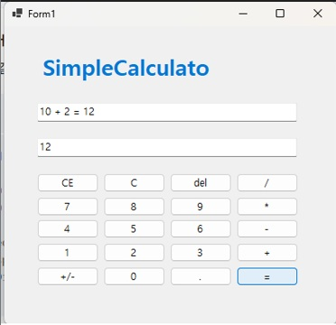
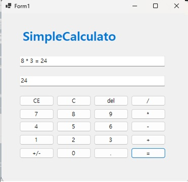
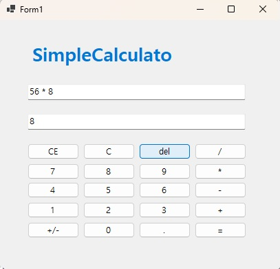
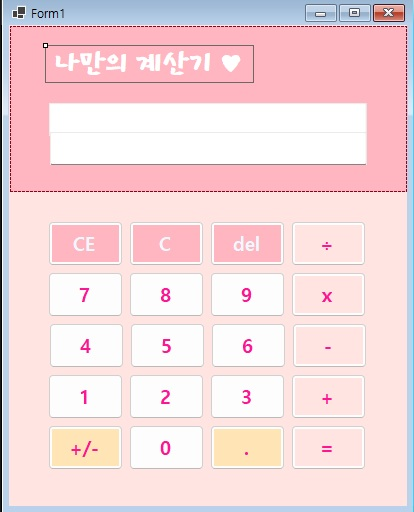
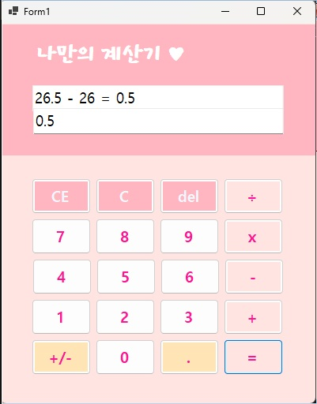
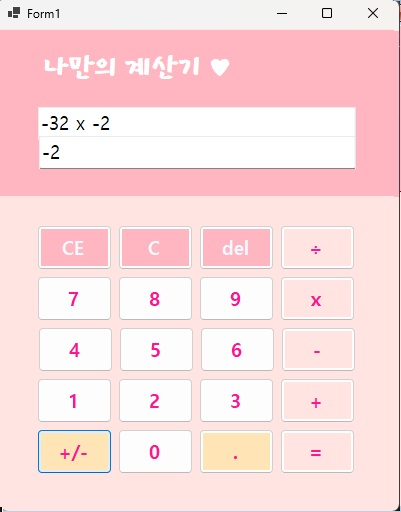

# (c#코딩) 심플사칙연산기(Simple Calculator)

##개요 
-c# 프로그래밍 학습
-설명 : 버튼에 입력한 정보를 텍스트 박스로 받아 계산 해주는 계산기 프로그램
-사용한 플랫폼 : net windows forms, visual studio, git hub 
-사용한 컨트롤 : label 1개, text box 2개, button 20개
-사용한 기술과 구현한 기능 : 
 -  컨트롤 배치와 기본적인 속성 제어 
 -  데이터 처리 및 연산 로직
 -  문자열 처리 및 동적 텍스트 결합
 -  사용자 편의 기능 (수정/삭제)

   ## 실행 화면 (과제 1)
   -과제 1 코드의 실행 스크린

   
   
   
  #과제내용
   
     -Label(표시), TextBox(입력), Button(전송), ListBox(대화창)를 배치, 
   
     -전송 버튼 클릭 시 TextBox의 텍스트를 ListBox의 항목(Items)으로 추가,
   
     -추가 직후 TextBox의 내용을 비워(Clear) 다음 입력을 준비
   
   
   #구현 내용과 기능 설명
   
     - 가독성과 사용성을 고려하여 상단에는 상태 표시용 Label과 입력용 TextBox를, 중앙에는 계산기 Button 을 배치.
     
     - 전송(또는 계산) 버튼 클릭 시, TextBox.Text 속성에 입력된 문자열 값을 ListBox.Items.Add() 메서드의 인자로 전달하여 리스트박스 항목에 즉각적으로 추가되도록 구현
     
     - 데이터 추가 직후 TextBox.Clear() 메서드를 호출하여 입력창을 초기화함으로써, 사용자가 별도의 삭제 작업 없이 다음 데이터를 바로 입력할 수 있도록 입력 편의성을 극대화

  ## 실행 화면 (과제 2)
   -과제 2 코드의 실행 스크린

   
   
  #과제내용
   
     - 빼기, 곱하기, 나누기구현하기
   
     - 뺄셈(-), 곱셈(*), 나눗셈(/) 버튼추가
   
     - 이벤트연결

     - 각 버튼 클릭시 연산자만 변경하여 동일 로직 적용
   
   
   #구현 내용과 기능 설명
   
     - 기존 더하기 기능에 더해 뺄셈(-), 곱셈(x), 나눗셈(÷) 버튼을 추가 배치하여 사칙연산이 가능한 종합 계산기 UI를 완성
     
     - 각 연산 버튼마다 별도의 코드를 작성하는 대신, 공용 이벤트 핸들러를 생성하여 클릭된 버튼의 Text 속성값에 따라 연산자만 동적으로 변경되도록 설계
     
     - 결과(=) 버튼 클릭 시, 저장된 연산자 변수의 값을 if-else 조건문으로 판별하여 각 기호에 맞는 산술 연산이 수행되도록 구현

  ## 실행 화면 (과제 3)
   -과제 3 코드의 실행 스크린
   
   

  #과제내용
   
     - 계산기에 있는 수정/삭제 기능 구현하기
   
     - C, CE, Del 버튼 기능 버튼 추가
   
     - 이벤트 연결
   
   
   #구현 내용과 기능 설명
   
     - 사용자의 입력 실수에 유연하게 대응하기 위해 C와 CE 기능을 구분하여 구현
     
     - Del 버튼 클릭 시 문자열의 마지막 문자를 제거하는 기능을 구현
     
     - 텍스트박스가 비어있는 상태에서 삭제 명령이 수행될 때 발생할 수 있는 오류를 방지하기 위해 조건문을 활용한 예외 처리를 적용

  ## 실행 화면 (과제 4)
   -과제 4 코드의 실행 스크린

   

   

   

  #과제내용
   
     - 계산기에 있는 부호 반전/ 소수점 기능 구현하기
   
     - +/-, . 버튼 기능 버튼 추가
   
     - 이벤트 연결

     - ui 디자인
   
   
   #구현 내용과 기능 설명
   
     - 소수점 연산 시 발생할 수 있는 부동 소수점 오차를 방지하기 위해 double 로 정확도를 높임
     
     - 소수점 버튼 클릭 시, Contains(".") 메서드를 활용하여 현재 입력된 숫자에 이미 소수점이 존재하는지 확인하는 예외 처리를 적용
     
     -부호 반전 버튼 클릭 시 현재 피연산자에 -1을 곱하는 산술 연산을 수행

     - ui를 개인적인 취향에 맞게 디자인 